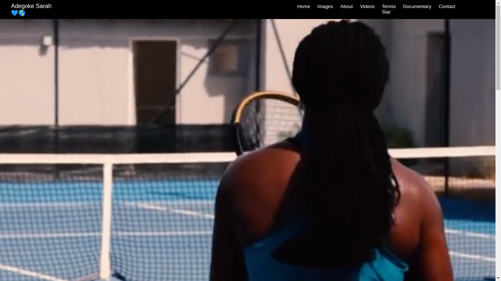

# Adegoke Sarah -  Tennis Star 

This project is a responsive website named "Adegoke Sarah" built using HTMl,CSS and JAVASCRIPT. The website is dedicated to showcasing the achievements and journey of one of Nigeria's superstar tennis women, Adegoke Sarah.

## Table of Contents

- [About Adegoke Sarah](#about-adegoke-sarah)
- [Project Features](#project-features)
- [Getting Started](#getting-started)
- [Contributing](#contributing)
- [License](#license)

## About Adegoke Sarah

Adegoke Sarah is a prominent figure in Nigerian tennis and has achieved numerous milestones in her career. This website serves as a platform to share her inspiring story, achievements, and upcoming events with fans and tennis enthusiasts.

## Project Features

The Adegoke Sarah website is designed to be responsive, meaning it adapts to different screen sizes and devices. The website includes the following features:

- **Homepage**: A visually appealing landing page with an introduction to Adegoke Sarah and her achievements.
- **About**: A detailed section providing information about Adegoke Sarah's background, career highlights, and personal interests.
- **Achievements**: A showcase of Adegoke Sarah's significant accomplishments in national and international tennis tournaments.
- **Gallery**: A collection of photos highlighting memorable moments from Adegoke Sarah's career.
- **Events**: An events calendar displaying upcoming tournaments and exhibition matches featuring Adegoke Sarah.

The website's responsive design ensures that it is accessible and visually appealing across various devices, including desktop computers, tablets, and mobile phones.

## Getting Started

To explore the Adegoke Sarah website, follow these steps:

1. Clone or download this repository to your local machine.

2. Open the project directory and navigate to the `index.html` file.

3. Open `index.html` in your preferred web browser to view the website.

4. Explore the different sections of the website, including the homepage, about, achievements, gallery, events, and contact.

5. Resize the browser window or view the website on different devices to experience its responsiveness.

6. Feel free to customize the website by modifying the HTML and CSS files to suit your needs or add additional features.

## Contributing

Contributions to this project are not accepted as it represents a specific website built for Adegoke Sarah. However, your feedback and suggestions are welcome. If you encounter any issues or have ideas for improvement, please feel free to reach out or create a fork of this repository to work on your own version of the website.

## License

This project is licensed under the [MIT License](LICENSE). Feel free to use the code and customize it for your own projects.

You can access the website below:

##  https://adegoke-sarah.netlify.app/
